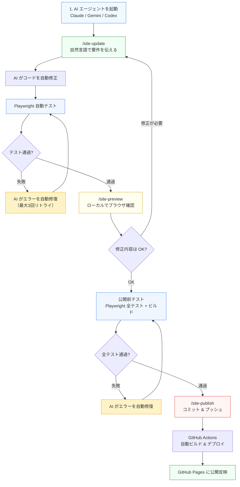
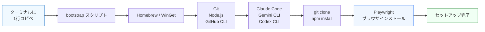
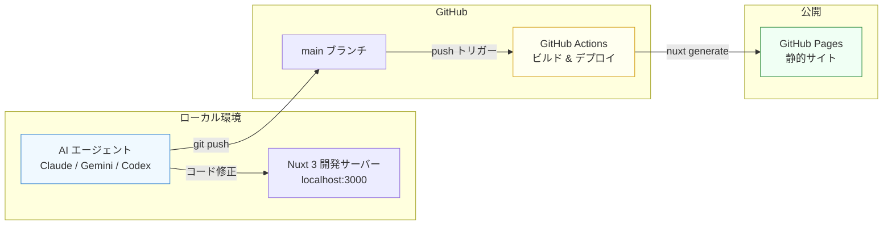
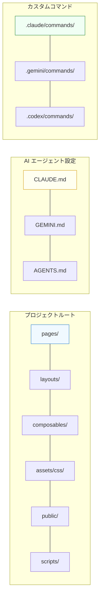

# 開邦高校同窓会 雄飛会 | 公式サイト

沖縄県立開邦高等学校の同窓会「雄飛会」公式サイトです。

## 技術スタック

| 技術 | バージョン |
|:---|:---|
| Nuxt | 3.14+ |
| Vue | 3.5+ |
| Tailwind CSS | 3.x |
| Node.js | 20+ |
| TypeScript | 5.6+ |

## はじめかた

ターミナルに **1行コピペするだけ** で、必要なツールが全て自動インストールされます。
Git や Node.js が入っていなくても大丈夫です。

### macOS / Linux

「ターミナル.app」を開いて（Spotlight で「ターミナル」と検索）、以下を貼り付けて Enter:

```bash
curl -fsSL https://raw.githubusercontent.com/kaiho-yuuhikai/official-site/main/scripts/bootstrap.sh | bash
```

### Windows

「PowerShell」を開いて（スタートメニューで「PowerShell」と検索）、以下を貼り付けて Enter:

```powershell
irm https://raw.githubusercontent.com/kaiho-yuuhikai/official-site/main/scripts/bootstrap.ps1 | iex
```

> **Windows の注意事項**
> - Claude Code / Codex CLI は WSL 上での動作を推奨します
> - WSL を使う場合: PowerShell で `wsl --install` → 再起動 → Ubuntu を開いて macOS と同じコマンドを実行

### セットアップ完了後

```bash
cd ~/official-site
claude    # または gemini / codex
```

AI エージェントが起動したら、すぐにサイトを更新できます:

```
/site-update トップページの見出しを変更して
```

<details>
<summary>手動セットアップ（上級者向け）</summary>

```bash
# macOS
brew install node@22 gh
curl -fsSL https://claude.ai/install.sh | bash
npm install -g @google/gemini-cli @openai/codex
git clone https://github.com/kaiho-yuuhikai/official-site.git && cd official-site && npm install
```

```powershell
# Windows (PowerShell)
winget install Git.Git OpenJS.NodeJS.LTS GitHub.cli
irm https://claude.ai/install.ps1 | iex
npm install -g @google/gemini-cli @openai/codex
git clone https://github.com/kaiho-yuuhikai/official-site.git; cd official-site; npm install
```

</details>

<details>
<summary>環境チェック</summary>

AI エージェント内で以下を実行すると、ツールの状態を一覧確認できます:

```
/setup-check          # Gemini / Codex の場合
/project:setup-check  # Claude Code の場合
```

不足がある場合は `/setup`（Claude Code は `/project:setup`）で自動修復できます。

</details>

## AI コーディングエージェント

本プロジェクトは 3 つの AI コーディングエージェントに対応しています。どれを使っても同じワークフローで操作できます。

| エージェント | 提供元 | 設定ファイル | 起動コマンド | 認証 |
|:---|:---|:---|:---|:---|
| [Claude Code](https://docs.anthropic.com/en/docs/claude-code) | Anthropic | `CLAUDE.md` | `claude` | Claude.ai アカウント |
| [Gemini CLI](https://github.com/google-gemini/gemini-cli) | Google | `GEMINI.md` | `gemini` | Google アカウント |
| [Codex CLI](https://github.com/openai/codex) | OpenAI | `AGENTS.md` | `codex` | ChatGPT アカウント |

各エージェントの初回起動時にブラウザが開き、ログインが求められます。画面の指示に従ってください。

### カスタムコマンド一覧

| コマンド | 機能 | Claude Code | Gemini / Codex |
|:---|:---|:---|:---|
| セットアップ | 環境構築 | `/project:setup` | `/setup` |
| 環境チェック | 状態確認 | `/project:setup-check` | `/setup-check` |
| サイト更新 | コード修正 | `/project:site-update 要件` | `/site-update 要件` |
| プレビュー | ローカル確認 | `/project:site-preview` | `/site-preview` |
| 公開反映 | デプロイ | `/project:site-publish` | `/site-publish` |

## デプロイ

GitHub Pages に自動デプロイされます。

- `main` ブランチへの push で自動デプロイ
- 毎日 9:00 JST に note.com RSS の自動更新 + 再デプロイ
- GitHub Actions の手動実行（workflow_dispatch）も可能

## サイト更新ワークフロー（ビジネスユーザー向け）

AI コーディングエージェントを使って、自然言語でサイトを更新できます。技術的な知識は不要です。

### サイト更新ワークフロー



### セットアップフロー



### デプロイアーキテクチャ



### 使い方の例

エージェントのプロンプトで以下のように入力するだけです:

```
/site-update トップページのキャッチコピーを「未来をつくる同窓会」に変更して
/site-update お問い合わせページにメールアドレス info@example.com を追加して
/site-update ナビゲーションに「イベント」メニューを追加して
```

### エージェント別のコマンド呼び出し方法

| エージェント | コマンドの書き方 |
|:---|:---|
| Claude Code | `/project:site-update 要件` `/project:site-preview` `/project:site-publish` |
| Gemini CLI | `/site-update 要件` `/site-preview` `/site-publish` |
| Codex CLI | `/site-update 要件` `/site-preview` `/site-publish` |

### 変更できるコンテンツの例

| 変更したい内容 | 入力例 |
|:---|:---|
| テキスト変更 | 「トップページの見出しを○○に変更して」 |
| 画像変更 | 「ヒーロー画像を新しい画像に差し替えて」 |
| ページ追加 | 「イベント情報ページを新規作成して」 |
| リンク変更 | 「フッターのFacebookリンクを○○に変更して」 |
| デザイン変更 | 「ボタンの色を緑から青に変更して」 |
| セクション追加 | 「トップページに活動実績セクションを追加して」 |
| コンテンツ追加 | 「ニュースに新しい記事を追加して」 |

## ディレクトリ構成



## ライセンス

Private
