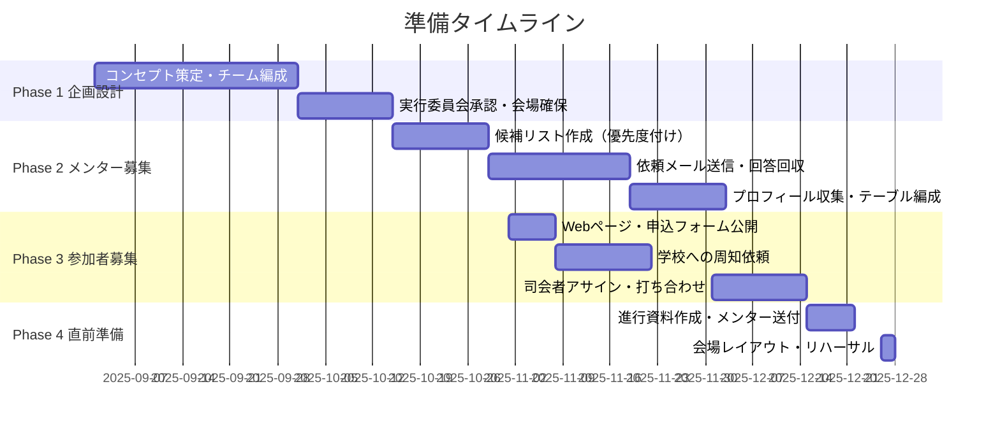
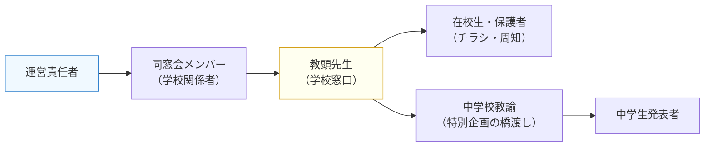
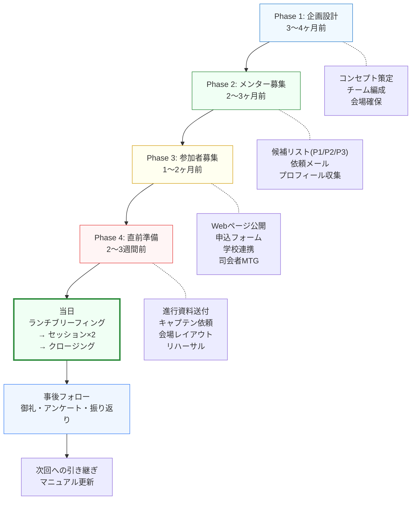

# 開邦キャリア・クロスロード 開催マニュアル

> 同窓会の大同窓会に併設して開催する、世代横断型キャリア交流イベントの企画・運営・当日進行の完全ガイド。
> 本書は2025年12月28日開催の第1回実績をもとに、個人情報を除外してナレッジ化したものです。

---

## 1. イベント概要

### 1.1 コンセプト

「キャリア・クロスロード」は、大同窓会の直前に開催する**世代横断型キャリア交流イベント**。単なる「進路相談会」ではなく、3つの価値を同時に実現する。

| 参加者層 | 提供する価値 |
|:---|:---|
| 在校生・大学生（メンティー） | **未来の羅針盤** — 先輩のリアルな経験から進路・キャリアのヒントを得る |
| 中堅・ベテラン卒業生（メンター） | **ビジネスチャンスの交差点** — 異業種の同窓生との新たなコラボレーション |
| 全参加者 | **逆メンタリング効果** — 若い世代の鋭い視点から刺激と学びを得る |

**背景にある思想**:
- 期を超えて同窓生同士のつながりを作り、卒業後も繋がれるネットワークを意識させる
- 将来的にリクルーティング的なネットワークとして機能させたい
- 同じ学校で過ごした共通体験やカルチャーが、一緒に仕事をするうえで活きる

### 1.2 イベント設計の原則:「聞く場」ではなく「話す場」をつくる

ビジネス系イベントにおいて、登壇者の話を一方的に参加者が聞くスタイルよりも、**初めて会う人に自分のことを話して共感してもらったり、理解してもらうミートアップ形式のほうが、参加者の満足度が圧倒的に高い**。

キャリア・クロスロードの設計は、この原則に基づいている。

**インタラクティブ性の最大化**:
- 参加者各々が自身の経験・悩み・展望を話し、それに対して周りの人が真剣に耳を傾ける場をつくる
- 「講演」ではなく「対話」。メンターもメンティーも全員が話し手であり聞き手
- セッションの時間配分（学生メンタリング20分 + 知見共有10分）も、学生が主体的に質問・発言することを前提に設計

**運営側で全てを事前に決める**:
- アジェンダ、席のレイアウト、テーブル配置、セッションの時間配分は全て運営側で事前に確定する
- **参加者に迷いを与えないこと**が最も重要。「どこに座ればいいか」「何を話せばいいか」「いつ移動するか」を参加者が考える必要がない状態をつくる
- 初めて会う人同士で構成されるイベントだからこそ、運営側ができるだけ緻密に設計する。そうすることで、参加者は**自分の話をすること、他の人の話を聞くこと**に集中できる

> 運営の仕事は「当日の進行」ではなく「当日までの設計」にある。参加者が何も迷わない状態をつくれたら、当日はほぼ自走する。

### 1.2 第1回実績サマリ

| 項目 | 内容 |
|:---|:---|
| 開催日 | 2025年12月28日（日）13:00〜14:30 |
| 会場 | ホテル宴会場（大同窓会本編と同施設の併設会場） |
| 位置づけ | 第3回大同窓会の事前イベント（本編は15:00〜） |
| メンター数 | 7テーブル × 2〜3名 = 約20名 |
| 参加者総数 | 約50名（メンティー約30名 + メンター約20名） |
| 運営スタッフ | 約14名（10〜30期台の幅広い世代で構成） |
| 特別企画 | 中学生による探究発表（約15分） |
| 参加費 | 無料（大同窓会の参加費に含む） |

---

## 2. 準備タイムライン

### Phase 1: 企画設計（本番3〜4ヶ月前）



| フェーズ | 時期 | 主なタスク |
|:---|:---|:---|
| Phase 1 | 3〜4ヶ月前 | コンセプト策定、運営チーム編成、実行委員会承認、会場確保、連絡用Googleグループ作成 |
| Phase 2 | 2〜3ヶ月前 | メンター候補リスト作成、依頼メール送信、回答回収、プロフィール収集、テーブル編成 |
| Phase 3 | 1〜2ヶ月前 | Webページ・申込フォーム公開、学校への周知、大同窓会参加者への案内、司会者アサイン |
| Phase 4 | 2〜3週間前 | 進行資料作成・送付、テーブルキャプテン依頼、会場レイアウト確定、リハーサル調整 |

### Phase 1 詳細: 運営チーム編成

**推奨構成**:
- **統括責任者**: 1名（企画全体のディレクション）
- **メンター担当**: 2〜3名（候補選定・依頼・フォロー）
- **学校連携担当**: 1〜2名（教育関係者が望ましい）
- **会場・設営担当**: 2〜3名
- **広報・Web担当**: 1〜2名
- **当日運営**: 3〜5名（受付、誘導、タイムキーパー等）

---

## 3. メンター募集・選定プロセス

### 3.1 候補リストの作成（優先度マトリクス）

大同窓会の参加申込データをもとに、以下の優先度で候補を選定する。

| 優先度 | 条件 | 備考 |
|:---|:---|:---|
| **P1（最優先）** | 大同窓会申込済み ＆ 特設授業等に未参加 | 新規の協力者を開拓 |
| **P2** | 大同窓会申込済み ＆ 特設授業に参加済み | 母校への貢献意識が高い |
| **P3（要打診）** | 大同窓会未申込 ＆ 特設授業に参加済み | 個別打診が必要 |

**除外条件**:
- 「第三者への個人情報提供に同意しない」と回答した方はメンター候補から除外

**テーブル別の候補選定**:
- 各テーブル（業種カテゴリ）に対して P1/P2 を優先的に配置
- P1/P2 で4名の枠が埋まらないテーブルは、P3 で補充（個別打診）
- メンター返信の集計結果: 英語科 4名、理数科 9名、計 13名が参加（第1回実績）

### 3.2 テーブル業種カテゴリ（7〜8卓）

| 卓No | 分野 | メンター目安 | 想定される職種例 |
|:---|:---|:---|:---|
| 1 | 医療 | 2〜3名 | 医師、歯科医師、薬剤師、看護師 |
| 2 | 法曹・行政・公共 | 2〜3名 | 弁護士、裁判所職員、公務員、議員 |
| 3 | 経営・起業 | 2〜3名 | 経営者、起業家、投資家 |
| 4 | IT・テクノロジー | 2〜3名 | エンジニア、研究者、SE |
| 5 | 教育・人材 | 2〜3名 | 大学教員、キャリアコンサルタント |
| 6 | メディア・芸能 | 2名 | アナウンサー、映像、エンタメ |
| 7 | 芸術・クリエイティブ | 2〜3名 | 音楽家、陶芸家、デザイナー |
| (8) | 自由交流 | 任意 | 上記に当てはまらない分野 |

### 3.3 メンター依頼メール テンプレート

```
件名: 【○○大同窓会】○/○ 当日企画「キャリア・クロスロード」メンターご登壇のお願い

（○期・○科） ○○ ○○ さん

お世話になっております。
○○高校○○期の○○です。この度は大同窓会へのお申し込み、誠にありがとうございます。

大同窓会当日の直前（13:00〜14:30）に開催する、キャリア交流イベント
「キャリア・クロスロード」の「キャリア・メンター」として、
ご参加いただきたくご連絡いたしました。

このイベントは、単なる在校生向けの「進路相談会」ではありません。
在校生や若手卒業生にとっては「未来の羅針盤」を見つける場であると同時に、
メンターの皆様にとっては「新たなビジネスチャンスの交差点」となることを目指しています。

【企画概要】
・日時: ○年○月○日（○） 13:00〜14:30
・場所: 本編会場併設会場
・ご依頼: 「○○系」テーブルのキャリア・メンター
・メンター集合: 当日 11:30（ランチブリーフィング）

■ 当日の運営
「メンター2〜3名＋学生5名」を1テーブルの目安としておりますが、
参加状況により柔軟に調整いたします。
学生参加が少ない場合は、メンター同士のビジネス交流時間を確保します。

○月○日（○）までに、ご参加の可否をお聞かせください。
```

**依頼時のポイント（実績からの学び）**:
- 「ビジネスチャンスの交差点」というメンター側のメリットを明示すると快諾率が高い
- 会社名の公開可否を事前に確認する（プライバシーへの配慮）
- 「異業種の卒業生とのコラボレーション」に期待するメンターが多い

### 3.4 プロフィール収集（Googleフォーム）

| 項目 | 必須/任意 | 用途 |
|:---|:---|:---|
| 氏名 | 必須 | 進行資料、Webサイト |
| 卒業期・学科 | 必須 | テーブル配置の参考 |
| 電話番号 | 必須 | 当日の緊急連絡 |
| 専門分野（テーブル選択） | 必須 | テーブル割り振り |
| プロフィール写真（URL） | 任意 | Webサイト・パンフレット |
| 現在の所属・役職 | 必須 | Webサイト・パンフレット |
| プロフィール・経歴 | 必須 | Webサイト・パンフレット |
| 学生へのメッセージ | 任意 | Webサイト |
| 個人情報取扱への同意 | 必須 | 法的要件 |

---

## 4. 参加者募集

### 4.1 参加申込フォーム項目

| 項目 | 必須/任意 | 用途 |
|:---|:---|:---|
| 氏名 | 必須 | 受付 |
| メールアドレス | 必須 | 連絡 |
| 所属区分 | 必須 | 在校生/大学生/社会人（若手）/社会人（中堅） |
| 現在の所属 | 必須 | 学校名・学年 or 会社名 |
| 卒業期・学科 | 該当者 | 参考情報 |
| メンターに相談したいこと（複数選択） | 任意 | テーブルマッチング |
| 希望職種・話を聞きたい分野（複数選択） | 任意 | テーブルマッチング |
| 同伴者人数 | 必須 | 人数管理 |
| 初期配置依頼（希望テーブル） | 任意 | 当日の席割り |
| 個人情報取扱への同意 | 必須 | 法的要件 |

### 4.2 相談したいこと 選択肢

- 具体的な仕事内容や、やりがい・苦労について聞きたい
- 進路や勉強法について相談したい
- 中堅・ベテラン卒業生とネットワーキングしたい
- キャリアの分岐点（転職・起業など）について聞きたい
- 生成AI時代に求められるスキルやキャリアについて不安がある
- 高校・大学時代の過ごし方についてアドバイスが欲しい

### 4.3 第1回の参加者構成（匿名化）

| 属性 | 人数 | 内訳 |
|:---|:---|:---|
| 社会人（中堅・ベテラン） | 約12名 | 医療、法曹、教育、IT、経営など |
| 在校生（高校生） | 約6名 | 1〜2年生中心 |
| 大学生 | 約2名 | |
| 中学生（探究発表） | 3名 | 引率教諭2名含む |

**学生の関心が高い分野**: 医療系、IT・テクノロジー系、メディア系、経営・起業

### 4.4 学校連携



**周知の手段**:
- 学校経由: 教頭先生 → 担任 → 生徒（チラシ配布）
- 大同窓会参加者への個別メール案内
- 創立記念式典等の学校行事でのチラシ配布
- イベントWebページ（参加申込フォーム付き）

**中学生の探究発表を受け入れる場合の確認事項**:
- 発表者名の公開可否
- 発表概要のWebサイト掲載可否
- リハーサル参加の可否と時間
- 引率教諭の参加申込
- プレゼンデータの事前共有

---

## 5. 当日の運営

### 5.1 詳細タイムテーブル

```mermaid
gantt
    title 当日タイムテーブル
    dateFormat HH:mm
    axisFormat %H:%M
    section 準備
    メンター集合・ランチブリーフィング   :a1, 11:30, 60min
    会場設営                           :a2, 12:00, 30min
    中学生リハーサル                    :a3, 12:15, 15min
    最終確認・受付準備                  :a4, 12:30, 10min
    section 受付
    開場・受付                         :b1, 12:30, 30min
    section 本編
    オープニング（学生MC）              :c1, 13:00, 5min
    特別企画（中学生探究発表）           :c2, 13:05, 15min
    Session 1                          :c3, 13:20, 30min
    移動                               :c4, 13:50, 5min
    Session 2                          :c5, 13:55, 30min
    クロージング                        :c6, 14:25, 5min
```



| 時刻 | 内容 | 場所 |
|:---|:---|:---|
| 11:30 | メンター集合 | ホテル内カフェ |
| 11:30〜12:30 | ランチブリーフィング（軽食・最終共有） | ホテル内カフェ |
| 12:00 | 会場設営開始 | 宴会場 |
| 12:15 | 中学生リハーサル（該当する場合） | 宴会場 |
| 12:30〜12:40 | メンター会場移動・立ち位置確認 | 宴会場 |
| 12:30〜13:00 | 開場・受付（参加者は配布物を見て希望テーブルへ移動） | 宴会場 |
| 13:00〜13:05 | オープニング（学生MCより全体案内） | |
| 13:05〜13:20 | 特別企画：中学生 探究発表（約15分） | |
| 13:20〜13:50 | **Session 1**（30分） — 第1希望テーブル | |
| 13:50〜13:55 | 移動（5分） | |
| 13:55〜14:25 | **Session 2**（30分） — 第2希望テーブル | |
| 14:25〜14:30 | クロージング（大同窓会本編への移動案内） | |

### 5.2 セッション進行（30分 × 2回）

各テーブルは「**学生向けメンタリング（20分）→ 卒業生（社会人）知見共有（10分）**」で進行。

| 経過 | フェーズ | 進め方 |
|:---|:---|:---|
| 0:00〜0:02 | 入口 | 円卓で「名前だけ」自己紹介（短く） |
| 0:02〜0:20 | **学生中心（メンタリング）** | 学生の質問・相談を優先 |
| 0:20〜0:28 | **知見共有** | 経験談・業界のリアルを短めに共有 |
| 0:28〜0:30 | まとめ | ひとことまとめ → 次テーブルへ移動案内 |

### 5.3 テーブルキャプテン制

各テーブルのメンター1名を「テーブルキャプテン（進行役）」に指名。

**キャプテンのお願い（合図3回だけ）**:
1. **開始**: 「前半は学生の質問・相談を優先しましょう」と一言
2. **切替（20分目安）**: 「後半に切り替えましょう」と一言
3. **締め（残り2分）**: 「まとめに入りましょう」と一言

> ポイント: 負担を「合図3回」に絞ることで、メンター本人も対話に集中できる

### 5.4 質問カテゴリ（会場スライド掲示）

学生が対話を進めやすくするための8つの質問ガイドを会場スライドに掲示:

| No | 質問カテゴリ | 具体例 |
|:---|:---|:---|
| 1 | 仕事のリアル | 実際の1日の流れ、大変なこと、面白いこと |
| 2 | 決め方・分岐点 | 迷った時の軸、決め手になったこと |
| 3 | 成長のしかた | 勉強・練習・習慣で効果があったこと |
| 4 | 失敗と立て直し | 折れた経験、どう戻ったか |
| 5 | 向き不向き | 向いている人の特徴、工夫していること |
| 6 | 今やるべき一歩 | 今日からできること |
| 7 | 未来・AI時代 | 変わること、変わらない力 |
| 8 | 自由質問 | 自分の言葉で聞く |

> 学生はこれを起点に、自分の言葉に言い換えて質問してOK

### 5.5 司会者（学生MC）

**推奨**: 大学生〜若手社会人（在校生と社会人メンターの間のブリッジ役）

**事前準備**:
- 本番1ヶ月前: 統括責任者と初回オンラインMTG（30〜60分）
  - イベントの背景と目的の共有
  - 司会としての役割の認識合わせ
  - 「何かしら問い（中テーマ）を立てる」ことを依頼
- 本番2〜3週間前: 司会用スライドの骨子を統括が作成 → 司会者にレビュー依頼
- 前日: 最終打ち合わせ（スライドのページング担当、人数均等化の誘導方法など）

**当日の役割**:
1. オープニング — イベント趣旨説明
2. 特別企画の進行 — 中学生発表の紹介・質疑の誘導
3. セッション合図 — 開始・ローテーション・終了
4. 場づくり — 会場巡回、人数が偏っているテーブルへの誘導
5. クロージング — 締め・大同窓会本編への誘導

**スライドのページング**: 統括がPC卓で操作、司会者は説明と場づくりに集中

### 5.6 会場レイアウト

```
┌──────────────────────────────────────────────┐
│                  スクリーン                    │
│    ┌──────┐    ┌──────┐                      │
│    │登壇台│    │PC台  │                      │
│    └──────┘    └──────┘                      │
│                                              │
│  ○ 卓1        ○ 卓2        ○ 卓3            │
│  (医療)       (法曹/行政)   (経営/起業)       │
│                                              │
│  ○ 卓4        ○ 卓5        ○ 卓6            │
│  (IT/Tech)    (教育/人材)   (メディア/芸能)   │
│                                              │
│  ○ 卓7                                      │
│  (芸術/Creative)                             │
│                                              │
│                           受付 →             │
└──────────────────────────────────────────────┘
```

**ホテルへの連絡事項**:
- 会場レイアウト図（Google Docs で共有）
- 演目名の掲示依頼（前日までに変更可能か確認）
- 進行表（プログラム）の共有
- 機器: プロジェクター、マイク、スクリーンの手配確認
- 登壇台（スクリーンを背にして左）・PC台（右）の配置指示

### 5.7 メンターへのお願い事項

1. **学生の発言・希望を否定しない** — 「どうすると近づくか」で返す
2. **写真撮影・SNS投稿は配慮** — 未成年参加者がいるため、本人同意が前提
3. **個人情報・連絡先の扱いに注意** — 名刺交換は社会人同士のみを推奨

---

## 6. 事後フォロー

### 6.1 当日〜1週間以内

| タスク | 詳細 | ツール |
|:---|:---|:---|
| 写真共有 | フォトアルバムを作成し、関係者限定で共有 | Googleフォト |
| 御礼メール | メンター全員 + 学校関係者へ個別に感謝メール | Gmail |
| 事後アンケート | 参加者全体にアンケート（回答期限2〜3週間） | Googleフォーム |

**御礼メールに含める内容**:
- 当日のフォトアルバムURL（関係者限定共有）
- 参加者アンケートからの声（抜粋）
- 運営メンバー一覧
- SNS掲載時のプライバシー保護のお願い

### 6.2 2〜3週間後

| タスク | 詳細 |
|:---|:---|
| アンケート結果集計 | 満足度、改善提案、次回への要望を整理 |
| 振り返りミーティング | 実行委員会での振り返り・改善点の共有 |
| 次期運営への引き継ぎ | 本マニュアルの更新 |

### 6.3 経費精算

第1回実績:
| 費目 | 金額 |
|:---|:---|
| イベントWebサイト プラン利用料（約2ヶ月分） | 約11,000円 |
| ドメイン取得費用 | 約8,400円 |
| **合計** | **約19,400円** |

> メンターへの謝礼なし、会場費は大同窓会本体の予算に含む

---

## 7. ICTツール活用と非同期コミュニケーション戦略

### 7.1 運営の基本原則: 「文書で共有し、非同期で合意を取る」

本イベントの運営で最も重要な学びは、**関係者全員が同時に集まるオンラインミーティングは極力避け、文書ベースの非同期コミュニケーションを主軸にする**ということである。

**なぜ非同期か**:
- 運営メンバーは10名以上、メンターは20名以上。社会人が中心のため、同期的な日程調整は極めて困難
- 全員が合うのは「当日」のみ。それまでのプロセスは全て非同期で回す前提で設計する
- オンラインMTGが必要なのは、**司会者との認識合わせ（1〜2回）** と **運営定例（週1回・任意参加）** 程度

**なぜそれで回るのか**:
- 開邦高校の卒業生は、目的や意義が明確に言語化されていれば賛同し、自律的に動いてくれる
- 逆に言えば、「なぜやるのか」「何を期待しているのか」「当日何をすればよいか」を曖昧にしたまま口頭で伝えても効果が薄い
- **やることを明文化して文章で共有する**ことが、最も効率的かつ確実な合意形成手段

```mermaid
flowchart LR
    subgraph 非同期（文書共有）
        A["メンター依頼メール\n（目的・意義・役割を明文化）"]
        B["進行資料\n（Google Docs）"]
        C["プロフィール収集\n（Googleフォーム）"]
        D["当日スライド\n（Googleスライド）"]
    end
    subgraph 同期（最小限）
        E["司会者MTG\n（Google Meet × 1〜2回）"]
        F["運営定例\n（週1回・任意参加）"]
    end
    subgraph 自動化（GAS）
        G["フォーム回答 → 自動集計"]
        H["依頼メール → 一括送信"]
        I["返信状況 → 自動追跡"]
    end

    A --> B --> D
    C --> G
    A --> H --> I

    style A fill:#f0f9ff,stroke:#3182ce
    style G fill:#f0fff4,stroke:#2d8c3c
    style E fill:#fffff0,stroke:#d4a017
```

### 7.2 制作物の自動化・AI活用

第1回では、以下の制作物を **Google Apps Script（GAS）** と **AI画像生成（Gemini 画像生成モデル）** を活用して制作した。手作業を最小化し、少人数の運営でも高品質なアウトプットを実現した。

| 制作物 | 作成方法 | 詳細 |
|:---|:---|:---|
| **参加申込フォーム** | GAS + Googleフォーム | フォーム回答がスプレッドシートに自動集計。属性別の参加者数やテーブル希望の分布をリアルタイムで把握 |
| **メンター依頼メール（一括送信）** | GAS | スプレッドシートの候補リストから、宛名・業種テーブル名を差し込んだ個別メールを一括送信。手作業で20通以上書く必要がなくなった |
| **メンター返信状況の追跡** | GAS | 返信メールを自動で検知し、スプレッドシートの「参加可否」列を更新。未返信者へのリマインドも自動化 |
| **事前配布マニュアル（進行資料）** | AI（LLM）+ Google Docs | イベントコンセプト・タイムテーブル・セッション進行などの文書をAIで下書き → 人間がレビュー・調整 |
| **当日の開催スライド** | AI画像生成（Gemini） | 司会用スライド、会場掲示用の質問カテゴリパネルをAI画像生成で制作。デザイナーなしでプロフェッショナルなビジュアルを実現 |
| **イベントWebページ（LP）** | Webサイトビルダー | メンタープロフィール、タイムテーブル、申込リンクをノーコードで構築 |

**GAS活用のポイント**:
- Googleフォームの回答 → スプレッドシートへの自動集計は標準機能だが、GASを使うことで「回答内容に応じた自動メール返信」「特定条件の集計」などを追加できる
- メンター候補リストのスプレッドシートに「連絡担当者」列を設け、担当者ごとに依頼メールを分担送信する仕組みも GAS で実現

**AI活用のポイント**:
- 依頼メール、進行資料、御礼メールなどの文書は、過去の実績やコンセプトをプロンプトとして与え、AIに下書きさせる → 人間がレビュー
- 開催スライドや掲示物のデザインは、Gemini画像生成モデルで「プロフェッショナルなビジネススライド」として生成
- これにより、デザイナーやライターをアサインする必要がなく、統括責任者1名 + AIで制作物の大半をカバーできた

### 7.3 使用ツール一覧

| ツール | 用途 |
|:---|:---|
| **Googleグループ** | 運営チームの連絡用メーリングリスト |
| **Googleフォーム** | ① 参加申込 ② メンタープロフィール収集 ③ 事後アンケート |
| **Googleスプレッドシート** | ① 申込回答の自動集計 ② スピーカー候補リスト（優先度管理） ③ メンター返信状況の追跡 |
| **Google Apps Script（GAS）** | フォーム自動集計、依頼メール一括送信、返信状況の自動追跡 |
| **Google Docs** | 進行資料（メンター配布用）、会場レイアウト図 |
| **Googleスライド** | 司会用スライド、会場掲示用質問カテゴリ |
| **Googleフォト** | 当日写真の限定共有 |
| **Google Meet** | 司会者・運営との事前オンラインMTG（最小限） |
| **AI（LLM）** | 依頼メール・進行資料・御礼メールの下書き生成 |
| **AI画像生成（Gemini）** | 開催スライド・掲示物のデザイン生成 |
| **Webサイトビルダー** | イベントLP（メンタープロフィール、タイムテーブル、申込リンク） |

### 7.2 スプレッドシートの構成（推奨）

1つのスプレッドシートに以下のシートを用意:

| シート名 | 内容 |
|:---|:---|
| スピーカー候補リスト | 優先度(P1/P2/P3)、氏名、卒業期、学科、職業、出典 |
| メンター返信状況 | 氏名、期、学科、職種、参加可否、最終返信日、返信要約 |
| メンター返信サマリ | 職種 × 学科のクロス集計（参加確定者数） |
| 事前イベントメンターリスト_v2 | テーブル別のメンター配置表（連絡担当者欄付き） |

### 7.3 メールテンプレート集

<details>
<summary>メンター依頼メール（本文は3.3節参照）</summary>

件名パターン: `【○○大同窓会】○/○ 当日企画「キャリア・クロスロード」メンターご登壇のお願い`
</details>

<details>
<summary>進行資料送付メール</summary>

```
件名: 【重要】○/○ 事前イベント：当日進行資料（URL）のご案内

○○ ○○ 様

お世話になっております。○○大同窓会 運営事務局（会場班）です。
事前イベントにつきまして、メンターの皆様へ「当日進行資料（現時点案）」のURLをご案内いたします。

▼進行資料（Google Docs）
（URL）

【当日の集合】
集合：11:30
場所：（ホテル名・カフェ名）
会場：（ホテル名・宴会場名）

【当日の進行（要点）】
・セッションは30分×2回（ローテーション）です。
・時間配分の目安：学生向けメンタリング20分 → 卒業生知見共有10分
・質問カテゴリ（8つ）は会場スライドに掲示します。

※本資料は現時点案であり、当日の来場状況により軽微な調整を行う場合があります。

【テーブルキャプテンへのお願い】
当日は、開始／20分目安で切替／締め（残り2分）の「合図3回」だけご協力ください。
```
</details>

<details>
<summary>参加者への案内メール</summary>

```
件名: 大同窓会前に開催｜事前交流イベントへのご招待

大同窓会参加者の皆さま

事前イベントのご案内です。
メンター（先輩卒業生）と気軽に交流できる場として企画しています。

このイベントは、「誰かが教える場」ではなく、
それぞれの立場にとって学びや気づきのある交流の場です。

・一人参加OK
・聞くだけ参加も歓迎

▼ 詳細・お申し込み
（イベントページURL）
```
</details>

<details>
<summary>御礼メール</summary>

```
件名: 【御礼と写真共有】キャリア・クロスロード ○○｜世代を超えて交差した知見と未来

卒業生・在校生・関係者の皆様

イベントにご参加いただき、誠にありがとうございました。

■ 当日のフォトアルバム
URL：（限定共有リンク）
※参加者・関係者限定での共有をお願いいたします。
※SNS等への掲載は写っている方へのご確認をお願いいたします。

■ 参加者アンケートより
（アンケート結果の抜粋を記載）
```
</details>

---

## 8. 成功のポイント・教訓

### やってよかったこと

1. **全てを文書化し、非同期で合意を取った** — 関係者が多く日程調整が困難な中、依頼メール・進行資料・当日スライドの全てを文書として事前共有。目的と意義を明文化すれば、開邦卒業生は自律的に賛同・行動してくれる。同期MTGは司会者との認識合わせ（1〜2回）のみで十分だった
2. **GASとAIで制作物を自動化** — 依頼メールの一括送信、返信追跡の自動化、スライドのAI生成により、統括1名 + AIで運営の大半をカバー。デザイナー・ライター不要で高品質なアウトプットを実現
3. **「ビジネスチャンスの交差点」として訴求** — メンター側のメリットを明示し、快諾率を高めた
4. **テーブルキャプテン制（合図3回）** — 進行役の負担を最小化し、メンター本人も対話に集中
5. **中学生の探究発表を柔軟に受け入れ** — 学校側の提案で世代横断の幅が拡大。逆メンタリング効果も発生
6. **30分×2回のローテーション制** — 学生が複数の業種のメンターと話せる。20分+10分の時間配分が好評
7. **若手卒業生を司会に起用** — 在校生と社会人のブリッジ役として機能
8. **優先度マトリクスで候補を体系的に選定** — P1/P2/P3の仕組みで、限られた人脈から効率的に確保
9. **メンターからの改善提案を受け入れ** — 「業種別ではなくお悩み別テーブル」の提案など、次回への貴重なインプット

### 改善・検討事項

1. **周知の早期化・多チャネル化** — 在校生への周知を2ヶ月前から開始、SNS活用
2. **参加人数のプランB** — 学生が少ない場合のメンター同士交流プランを事前に用意
3. **オンライン参加枠** — 県外在住メンターもリモート参加できる仕組み
4. **事後アンケートの当日回収** — QRコードを会場で掲示し、その場で回答を促す
5. **専任カメラマン** — 写真撮影体制を事前にアサイン
6. **Will/Can/Must フレームワーク** — 打ち合わせで検討されたワークショップ型アウトプットを次回導入検討

### 参加者の声（匿名化）

> 「大人の皆さんが優しく相談に乗ってくれて将来の不安が軽くなった。将来こんな温かい先輩になりたい」 — 在校生

> 「自分の興味がある分野以外も知ることができて、新しい学びを得られた」 — 在校生

> 「中学生の探究発表の論理性に驚いた。母校の主体性の高さを誇りに思う」 — ベテラン卒業生

> 「他業種との交流が刺激になった。これぞ同窓会の醍醐味」 — 中堅卒業生

> 「非常に面白そうな企画ですね！ネーミングも魅力的です」 — メンター候補からの返信

---

## 9. 全体ワークフロー（まとめ）



---

*本マニュアルは第1回「キャリア・クロスロード」（2025年12月開催）の実績をもとに作成。個人を特定できる情報（氏名、連絡先、所属等）は除外し、再現可能なナレッジとして構成しています。次回開催時は、本書をベースに最新の状況に合わせて更新してください。*

*最終更新: 2026年3月*
