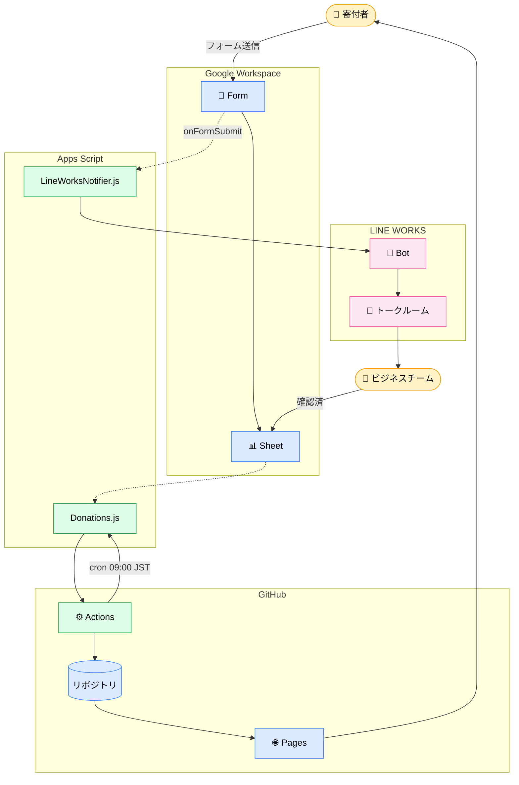

# 雄飛会公式サイト 開発・運用ハンドブック

このドキュメントは、**5/13 12:00-14:00 のスキトラ会で上から下に読みながら進める** ことを想定した手順書です。
**対象**: 開邦雄飛会公式サイトの開発・運用を引き継ぐビジネスチームメンバー (上間さん想定)
**ゴール**: フォーム改修・データ取得・HP 反映までの全フローを 1 人で回せる
**所要時間**: 約 2 時間 (デモ会の中で完走可能)

---

## 0. これから何をするか (Bird's Eye View)

このシステムは以下の 4 つの世界をつなげています:

| 世界 | 何の役割 | 誰が触る |
|---|---|---|
| 📝 **Google Workspace** | フォーム入力・データ保管・承認 | ビジネスチーム (上間 / 屋良) |
| ⚙️ **Apps Script (GAS)** | 集計・通知ロジック | 開発者 (神谷) |
| 🚀 **GitHub** | コード管理・自動デプロイ | 開発者 + ビジネスチーム |
| 🌐 **Web サイト** | 公開 HP <https://kaiho-yuuhikai.jp/> | 訪問者 |

### 全体アーキテクチャ



> 💡 **大事な原則**: 全部 **無料枠** で月額 ¥0 で運用しています。

---

# 📚 ステップ別 手順書

> このセクションを順に進めれば、デモ会の終わりには「自分で機能追加 → リリース」までできます。

---

## STEP 1: 環境セットアップ (10 分)

> **目的**: 上間さんの Windows に必要なツールを全部入れる
> **担当**: 上間さん主担、神谷さんサポート

### 1.1 必要なソフト

| 必要なもの | 役割 |
|---|---|
| **Git for Windows** | コード管理 (Git Bash 同梱) |
| **Node.js (v20 以上)** | ビルド・テスト |
| **GitHub CLI (`gh`)** | リポジトリ操作 |
| **Claude Code** | AI コーディング支援 |

### 1.2 リポジトリを clone

PowerShell or Git Bash で:

```bash
git clone https://github.com/kaiho-yuuhikai/official-site.git
cd official-site
```

### 1.3 開発環境一括インストール

PowerShell で:

```powershell
Set-ExecutionPolicy -Scope Process -ExecutionPolicy Bypass
.\scripts\setup.ps1                  # Node.js / gh / Claude Code 等
.\scripts\setup-google-clis.ps1      # clasp / gws / gog
npm install
npm run hooks:install                # pre-commit secret-scan
```

### 1.4 動作確認

Claude Code を起動:

```bash
claude
```

中で:

```
/setup-check
```

→ 全項目 ✅ ならステップ 2 へ。❌ があれば項目に従って修正。

---

## STEP 2: Google サービスへの認証 (10 分)

> **目的**: clasp / gws の OAuth を済ませて API を叩けるようにする
> **担当**: 上間さん単独 (神谷の dev アカウントで clasp ログインのみ確認)

### 2.1 ワンコマンドで認証ガイド

Claude Code 内で:

```
/setup-google-clis
```

→ 「現在の状態 → インストール → OAuth ガイド」を対話的に進めてくれる。

### 2.2 3 つの CLI の使い分け

| CLI | 用途 | 必須度 |
|---|---|---|
| **clasp** | GAS スクリプトの push / deploy | **必須** (寄付システム GAS 更新) |
| **gws** | Drive / Sheets / Forms / Gmail 等の API 操作 | **推奨** |
| **gog** | Drive 監査・読み取り業務 | 任意 |

### 2.3 認証確認

```bash
# clasp (開発者アカウント / dev ドメイン)
clasp login
clasp status

# gws (gcloud があれば最短)
gws auth setup
gws drive files list --params '{"pageSize": 5}'
```

⚠️ **clasp は雄飛会アカウントではなく開発者ドメインで login** (cross-domain redeploy 問題回避)

---

## STEP 3: 既存システムを見る (15 分)

> **目的**: 実際のフォーム・シート・サイトを画面共有で見て全体像を体感
> **担当**: 神谷さん画面共有、上間さん観察 + 操作

### 3.1 Google フォーム

- ブラウザで寄付申込フォームを開く
- 項目を確認 (お名前 / 入学期 / 寄付口数 / メッセージ / HP掲載 等)
- 実際に 1 件テスト送信してもよい

### 3.2 スプレッドシート

| 列 | 内容 | 編集者 |
|---|---|---|
| A | タイムスタンプ | フォーム自動 |
| B | メールアドレス | フォーム自動 |
| C | お名前 | フォーム自動 |
| D | 入学期 | フォーム自動 |
| E | 寄付先基金 | フォーム自動 |
| F | 寄付口数 | フォーム自動 |
| G | メッセージ | フォーム自動 |
| H | HP掲載可否 | フォーム自動 |
| **I** | **振込確認ステータス** | **手動** (未確認 / 確認済 / キャンセル) |
| **J** | **確認日** | **手動** (yyyy-mm-dd) |
| **K** | **確認者** | **手動** |

→ I 列のプルダウンを操作してみる (テスト行は後で削除)

### 3.3 GitHub Actions

- <https://github.com/kaiho-yuuhikai/official-site/actions> を開く
- 直近の `Deploy to GitHub Pages` run を確認
- 「毎朝 09:00 JST に自動」「main 更新時にも自動」の両方が動いていることを示す

### 3.4 GitHub Pages

- <https://kaiho-yuuhikai.jp/> を開く
- 「寄付者一覧」セクションを確認
- ブラウザを Ctrl+Shift+R で再読み込みすると最新が出る

---

## STEP 4: サイトの簡単な変更を試す (15 分)

> **目的**: 文言や画像の差し替えを Claude Code で行う体験
> **担当**: 上間さん主担

### 4.1 ローカルプレビューを起動

```
/site-preview
```

→ ブラウザで <http://localhost:3000/official-site/> を開く

### 4.2 変更を依頼

```
/site-update "トップページのキャッチコピーを「次の50年へ」に変更したい"
```

Claude が:
- 該当ファイルを特定 (`pages/index.vue`)
- 修正
- 自動テスト実行
- 「OK」と答えればプレビュー確認

### 4.3 本番反映

```
/site-publish
```

→ コミット + push + デプロイ → 数分後に本番サイトで確認

---

## STEP 5: 機能追加を試す (30 分)

> **目的**: Claude Code で「新機能 Issue 起票 → 実装 → マージ」を体験
> **担当**: 上間さん主担

### 5.1 現在の課題を見る

```
/issue-list
```

→ open Issue が一覧で表示される

### 5.2 新規 Issue を起票

```
/feature-add "<やりたいこと>"
```

例: `/feature-add "GA4 を雄飛会サイトに埋め込んで訪問者数を計測したい"`

Claude が背景・AC・緊急度をヒアリング → Issue を作成。

> 💡 デモ会では既に起票済みの **Issue #26 (GA4 埋め込み)** を使うと早い

### 5.3 実装

```
/feature-implement 26
```

Claude が:
- 仕様を読む
- 失敗テストを書く (RED)
- 最小実装 (GREEN)
- リファクタ + 全テスト (REFACTOR)
- secret-scan
- PR を作成

### 5.4 PR レビュー → マージ

```
/feature-review-merge <PR番号>
```

Claude が変更内容を日本語で説明 → 「OK」と答えればマージ → 自動デプロイ。

### 5.5 本番反映確認

数分後にブラウザで Ctrl+Shift+R → 動作確認 (GA4 ならリアルタイムレポート)

---

## STEP 6: LINE WORKS Bot を本番稼働 (30 分)

> **目的**: 寄付申込が来たら運営トークルームに自動通知する仕組みを実機稼働
> **担当**: 上間さん主担、神谷さん同席 (初回のみ)
> **前提**: Phase 1 (LINE WORKS Developer Console での 6 点取得) が完了済み

### 6.1 GAS コードを push

```bash
cd scripts/gas/donations
clasp login    # まだなら
clasp push
```

### 6.2 Script Properties に認証情報を投入

GAS エディタで `setupLineWorksProperties` 関数を選び、「⚙ 引数を指定して実行」:

```javascript
{
  LW_CLIENT_ID: '<Phase 1 で取得>',
  LW_CLIENT_SECRET: '<Phase 1 で取得>',
  LW_SERVICE_ACCOUNT: 'xxxx.serviceaccount@<domain>',
  LW_PRIVATE_KEY: '<<PEM形式の秘密鍵テキスト (改行込み)>>',
  LW_BOT_ID: '<Phase 1 で取得>',
  LW_CHANNEL_ID: '<Phase 1 で取得>',
  ADMIN_EMAIL: 'office@kaiho-yuhikai.com'
}
```

初回は権限承認ダイアログ → すべて「承認」

### 6.3 疎通テスト

GAS エディタで `testNotify` 実行 → 運営トークルームにテスト通知が届くか確認。

NG の場合:
- `401` → Service Account / Client Secret を再確認
- `403` → Bot をチャンネルに招待

### 6.4 トリガー登録

GAS エディタで `installFormSubmitTrigger` 実行 → 「トリガー」欄に `onFormSubmit` が 1 件あれば OK。

### 6.5 E2E テスト

本番フォームにテスト 1 件送信 → 運営トークルームで通知受信を確認。
テスト行はスプレッドシートで「キャンセル」or 削除。

詳しくは `docs/operations/line-works-notification-setup.md` 参照。

---

# 📋 日常運用フロー (デモ後の継続業務)

---

## 運用 A: 寄付申込みが来たとき (自動)

```
寄付者がフォーム送信
   ↓
スプレッドシートに行追加 (自動)
   ↓
運営トークルームに LINE WORKS 通知 (自動)
   ↓
[受信] 屋良 / 上間さんが内容確認
```

## 運用 B: 入金確認したとき (手動)

```
振込確認後、スプレッドシートを開く
   ↓
該当行の I 列「振込確認ステータス」を「確認済」にする
   ↓
J 列に確認日 (yyyy-mm-dd)
   ↓
K 列に確認者
   ↓
翌朝 09:00 に HP に自動反映 (急ぐなら Actions タブで手動実行)
```

## 運用 C: コンテンツ更新

| やりたいこと | コマンド |
|---|---|
| 文言の修正 | `/site-update` |
| 画像の差し替え | `/site-update` |
| 役員情報の更新 | `/site-update` |
| 新ページ追加 | `/feature-add` → `/feature-implement` |
| フォーム改修 | フォーム編集後 → `/feature-add` → `/feature-implement` |

## 運用 D: フォームを改修したとき

⚠️ **重要**: Form の項目を追加・削除すると Sheet の列順がずれて HP の集計が壊れる可能性あり。

```
1. Form を変更
2. /feature-add "フォームに○○を E 列に追加した、GAS と HP の集計も対応してほしい"
3. /feature-implement <Issue番号>
4. /feature-review-merge <PR番号>
```

---

# 🛟 困ったとき

## トラブルシューティング

| 症状 | 対処 |
|---|---|
| HP に反映されない | (1) Sheet の I 列が「確認済」か / (2) Actions が動いたか / (3) Ctrl+Shift+R で再読込 |
| LINE WORKS 通知が来ない | (1) Bot が招待されているか / (2) GAS で `testNotify()` でエラー確認 / (3) `showProperties()` で 6 点投入確認 |
| Claude Code でエラー | 日本語で「○○で詰まった」と聞く / `/setup-check` で再診断 |
| `clasp push` が拒否される | 開発者ドメインで login しているか確認 (`clasp logout && clasp login`) |
| Push protection エラー | コミットファイルに API トークン等が紛れていないか確認 (`npm run scan:secrets`) |

## 連絡先

- 急ぎ HP 修正: 神谷さんに Slack DM
- LINE WORKS 関連: `/feature-add` で Issue 起票
- 認証情報を失った: `docs/security/secret-handling.md` のローテーション手順

---

# 📖 リファレンス

## skill / コマンド一覧

| 種類 | コマンド | 用途 |
|---|---|---|
| 環境 | `/setup` | 開発環境一括インストール |
| 環境 | `/setup-check` | 環境チェック |
| 環境 | `/setup-google-clis` | Google CLI 三種セットアップ |
| サイト更新 | `/site-update` | テキスト・画像の小修正 |
| サイト更新 | `/site-preview` | ローカルプレビュー |
| サイト更新 | `/site-publish` | 本番反映 |
| 機能開発 | `/issue-list` | 課題一覧 |
| 機能開発 | `/feature-add` | 要望を Issue 化 |
| 機能開発 | `/feature-implement <N>` | Issue → 実装 → PR |
| 機能開発 | `/feature-review-merge <N>` | PR → 確認 → マージ |

## ファイル構成 (主要なもの)

| ファイル | 内容 |
|---|---|
| `pages/index.vue` | トップページ |
| `layouts/default.vue` | 共通レイアウト (ヘッダー・フッター) |
| `pages/about.vue` | 理念・沿革・会則 |
| `public/data/cms-data.json` | 動的データ (メンバー等) |
| `scripts/gas/donations/` | 寄付システム GAS |
| `docs/operations/line-works-notification-setup.md` | LINE WORKS 運用手順 |
| `docs/security/secret-handling.md` | 秘匿情報取扱い |

## 用語集

| 用語 | 意味 |
|---|---|
| GAS | Google Apps Script の略 |
| トリガー | GAS の自動実行設定 (フォーム送信時 / 時間指定 等) |
| clasp | GAS をローカルから push する CLI |
| Script Properties | GAS のキー・バリュー保管庫 (秘匿情報はここに入れる) |
| Issue | GitHub の課題管理 |
| PR | Pull Request の略 (変更案) |
| CI | 自動テスト・チェック |
| secret-scan | 秘密情報の誤コミット検出 |

## 参考リンク

| カテゴリ | リンク |
|---|---|
| 雄飛会リポジトリ | <https://github.com/kaiho-yuuhikai/official-site> |
| 雄飛会 HP | <https://kaiho-yuuhikai.jp/> |
| 開発計画 | `docs/donation-system-implementation-plan.md` |
| 寄付承認手順 | `docs/operations/donation-confirmation.md` |
| LINE WORKS 連携 | `docs/operations/line-works-notification-setup.md` |
| セキュリティ | `docs/security/secret-handling.md` |
| LINE WORKS Developers | <https://developers.worksmobile.com/jp/docs/> |
| GAS リファレンス | <https://developers.google.com/apps-script/reference> |

---

# ✅ デモ会で踏むチェックリスト

このハンドブックを上から順に進めれば全部触れます。チェックを入れながら進めてください。

- [ ] STEP 1 環境セットアップ
- [ ] STEP 2 Google サービス認証
- [ ] STEP 3 既存システムを見る
- [ ] STEP 4 サイトの簡単な変更を試す
- [ ] STEP 5 機能追加を試す
- [ ] STEP 6 LINE WORKS Bot を本番稼働
- [ ] 質疑応答 + 次回までの宿題確認

🎓 **次のステップ**: デモ後の宿題は Issue #27 に集約しています。
わからないことは GitHub Issue or Slack で気軽に質問してください。
